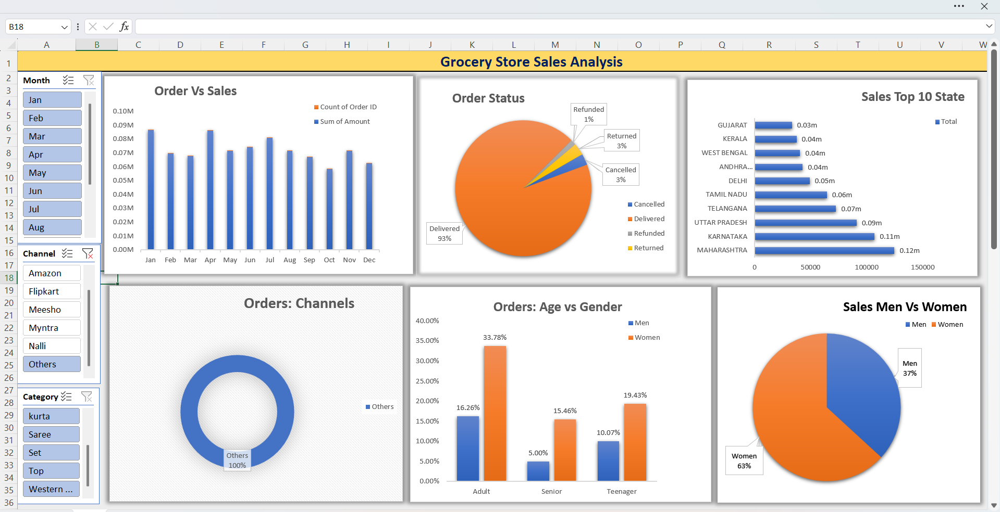
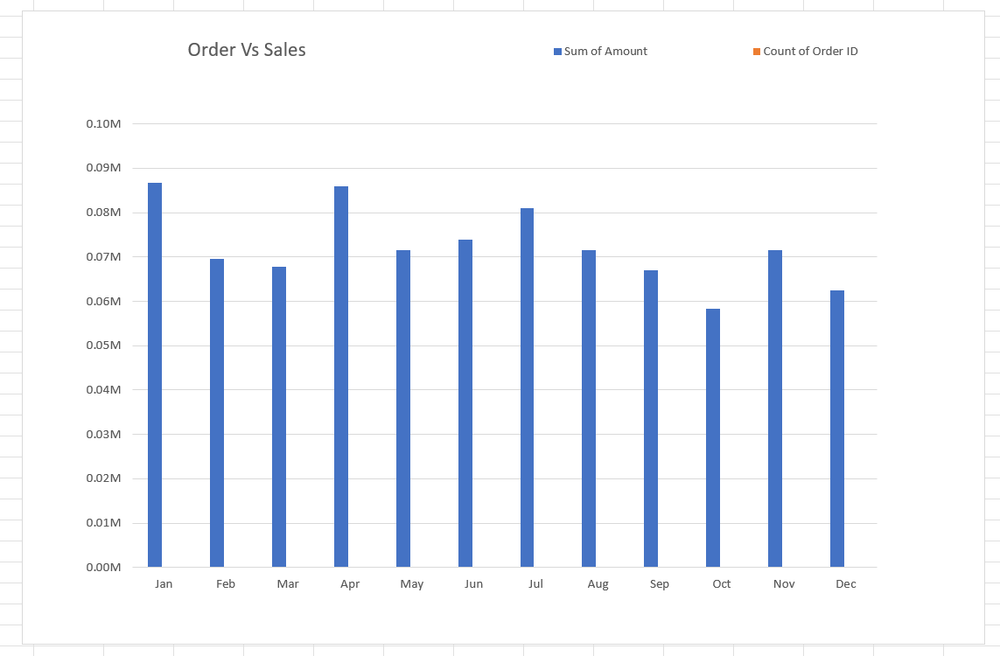
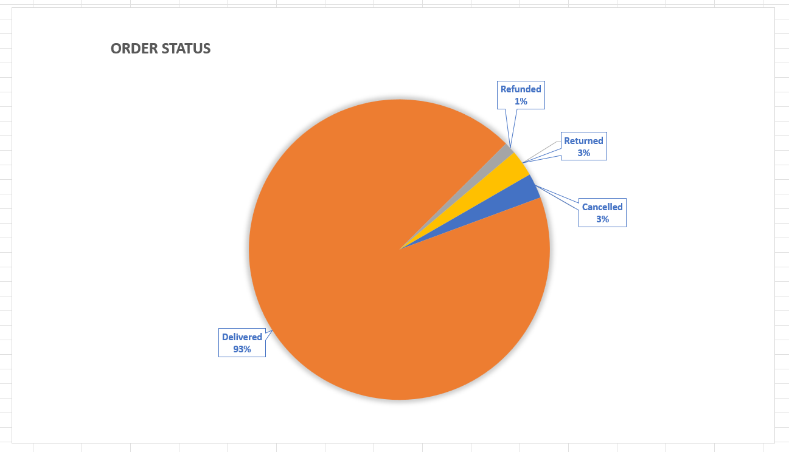
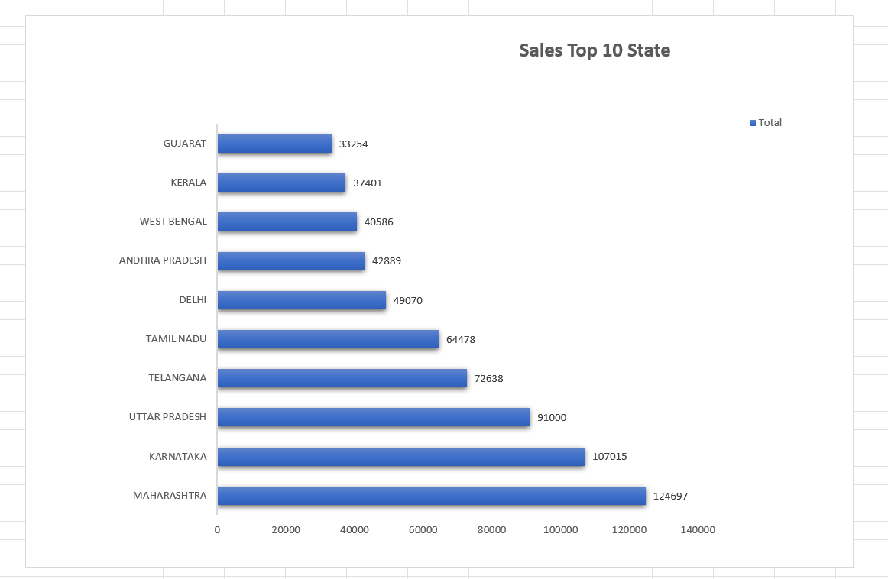

# 🛒 Grocery Store Sales Analysis Dashboard

> **An end-to-end Microsoft Excel Data Analytics project that transforms grocery/e-commerce sales data into an interactive dashboard for analyzing sales, orders, customers, sales channels, order status, and geographic performance.**

**12 Months | 7 Sales Channels | 4 Order Statuses | Top 10 States | 3 Age Groups | 3 Interactive Slicers**

This project demonstrates the complete analytics workflow from **data cleaning and preparation to Pivot-based analysis, interactive visualization, and business insights**.

---

## 📊 Project Overview

The **Grocery Store Sales Analysis Dashboard** was developed to convert raw grocery/e-commerce sales transaction data into a structured and interactive reporting solution.

The dashboard helps users:

- Analyze monthly sales and order performance
- Compare sales amount with order count
- Understand order status distribution
- Identify the Top 10 states by sales
- Compare orders across 7 sales channels
- Analyze customer orders by age group and gender
- Compare sales performance by gender
- Filter results using Month, Channel, and Category

### Analytics Workflow

```text
Raw Data
   ↓
Data Cleaning & Preparation
   ↓
Excel Tables
   ↓
Pivot Tables
   ↓
Pivot Charts
   ↓
Interactive Slicers
   ↓
Dashboard
   ↓
Business Insights
```

---

## 🔍 Business Problem

Raw transactional sales data can be difficult to interpret when business users need to review individual records manually.

The business needs a simple reporting solution to answer questions such as:

- How are sales and orders changing month by month?
- Which states are performing strongly?
- Which sales channels generate more orders?
- What is the distribution of different order statuses?
- Which customer segments contribute to order activity?
- How does performance change by month, channel, or category?

### The Challenge

The raw sales data needed to be transformed into an easy-to-understand reporting system where users could **filter, compare, and analyze business performance without manually reviewing individual transactions.**

### The Approach

I used Microsoft Excel to transform the data through:

**Raw Data → Cleaning → Structured Tables → Pivot Analysis → Visualization → Slicers → Dashboard**

### Business Value

The dashboard provides a single interactive view of key sales and customer metrics, making it easier to:

- Monitor business performance
- Compare different segments
- Identify performance patterns
- Explore sales and customer data efficiently
- Support data-driven decision-making

---

## 🎯 Project Objectives

- Clean and prepare raw sales data for analysis
- Structure the dataset using Excel Tables
- Analyze sales and orders across **12 months**
- Compare sales amount and order count
- Analyze **4 order statuses**
- Identify the **Top 10 states by sales**
- Compare orders across **7 sales channels**
- Analyze customer orders across **3 age groups**
- Compare Male and Female segments
- Analyze sales by gender
- Build an interactive Excel dashboard
- Implement **3 interactive slicers**
- Present analysis in a business-friendly format

---

## 📁 Dataset Description

The project is based on **grocery/e-commerce store sales transaction data**.

The dataset contains fields required for analysis across:

- Sales Amount
- Order Information
- Order Status
- State
- Sales Channel
- Customer Age Group
- Gender
- Product Category
- Month

### Dataset Scope

| Analysis Area | Scope |
|---|---:|
| Monthly Analysis | 12 Months |
| Order Status | 4 Statuses |
| Sales Channels | 7 Channels |
| Age Groups | 3 Groups |
| Geographic Analysis | Top 10 States |
| Gender Segments | 2 Segments |
| Interactive Filters | 3 Slicers |

> **Note:** These numbers represent the scope of the dashboard analysis. No unsupported revenue, percentage, growth, or performance figures are claimed.

---

## 🧹 Data Preparation & Cleaning

Before building the dashboard, the raw dataset was reviewed and prepared for analysis.

Key preparation activities included:

- Reviewing the raw dataset structure
- Checking data consistency
- Organizing data into Excel Tables
- Preparing categorical fields
- Preparing month/date information
- Ensuring fields were suitable for Pivot Table analysis
- Structuring the dataset for dashboard reporting

### Data Preparation Workflow

```text
Raw Dataset
     ↓
Data Review
     ↓
Cleaning & Formatting
     ↓
Structured Excel Table
     ↓
Pivot Analysis
     ↓
Dashboard
```

The objective was to create a **consistent and analysis-ready dataset** before performing business analysis.

---

## 🛠️ Tools & Technologies

| Tool / Technology | Usage |
|---|---|
| **Microsoft Excel** | Data cleaning, analysis and dashboard development |
| **Excel Tables** | Data structuring |
| **Pivot Tables** | Data aggregation and analysis |
| **Pivot Charts** | Data visualization |
| **Slicers** | Interactive filtering |

### Core Skills

`Microsoft Excel` `Data Cleaning` `Data Analysis` `Pivot Tables` `Pivot Charts` `Slicers` `Data Visualization` `Dashboard Design` `Business Intelligence`

---

# 📊 Dashboard Analysis

## 1. 📈 Monthly Sales & Orders

The dashboard compares **Order Count and Sales Amount from January to December**.

### Business Purpose

- Monitor monthly sales performance
- Compare order volume across months
- Compare sales value with order activity
- Identify changes in business activity over time

---

## 2. 📦 Order Status Analysis

Orders are analyzed across **4 statuses**:

- Delivered
- Cancelled
- Refunded
- Returned

### Business Purpose

Understand order outcomes and identify patterns that may require further operational analysis.

---

## 3. 🗺️ Top 10 States by Sales

The dashboard identifies the **Top 10 states based on sales performance**.

### Business Purpose

- Compare state-wise sales
- Identify leading geographic markets
- Understand geographic sales distribution
- Support further regional analysis

---

## 4. 🛍️ Sales Channel Analysis

Orders are analyzed across **7 sales channels**:

**Ajio | Amazon | Flipkart | Meesho | Myntra | Nalli | Others**

### Business Purpose

Compare channel-wise order activity and understand how orders are distributed across different e-commerce platforms.

---

## 5. 👥 Age Group & Gender Analysis

Customer order activity is analyzed across **3 age groups**:

**Adult | Senior | Teenager**

The dashboard also compares:

**Male | Female**

### Business Purpose

Understand customer order behavior across different demographic segments.

---

## 6. ⚥ Sales by Gender

Sales are compared between:

**Men | Women**

### Business Purpose

Understand gender-wise sales distribution and support customer-segment analysis.

---

# 🎛️ Interactive Slicers

The dashboard includes **3 interactive slicers**.

### 📅 Month

Filters the dashboard by selected month.

### 🛍️ Channel

Filters results by individual sales channel.

### 🏷️ Category

Filters results by product category.

### Interactive Analysis

```text
Month + Channel + Category
            ↓
     Dashboard Filters
            ↓
   Focused Business Analysis
```

Slicers allow users to explore different business segments without manually modifying Pivot Tables.

---

# 📈 Analysis Performed

| Analysis | Business Purpose |
|---|---|
| **Monthly Sales** | Understand sales performance across 12 months |
| **Monthly Orders** | Monitor order volume over time |
| **Sales vs Orders** | Compare sales value with order activity |
| **Order Status** | Analyze 4 order outcomes |
| **Top 10 States** | Identify leading geographic markets |
| **Channel Analysis** | Compare 7 sales channels |
| **Age Group Analysis** | Analyze customer order distribution |
| **Gender Analysis** | Compare customer orders and sales |
| **Slicer Analysis** | Explore performance by Month, Channel and Category |

The focus is on using the available data to answer **business-oriented questions**, not simply creating charts.

---

# 💡 Key Business Insights

The dashboard enables users to:

### 📈 Sales Performance
- Compare sales and order activity across **12 months**
- Compare sales amount with order count
- Identify periods with relatively higher or lower activity

### 📦 Order Fulfillment
- Analyze the distribution of **4 order statuses**
- Compare Delivered, Cancelled, Refunded, and Returned orders

### 🗺️ Geographic Performance
- Identify the **Top 10 states by sales**
- Compare state-wise sales performance

### 🛍️ Channel Performance
- Compare order activity across **7 sales channels**
- Analyze individual channels using the Channel slicer

### 👥 Customer Analysis
- Compare orders across **3 age groups**
- Compare Male and Female customer activity
- Analyze gender-wise sales distribution

### 🎛️ Interactive Analysis
- Filter by Month
- Filter by Channel
- Filter by Category
- Compare selected business segments dynamically

---

# 🖼️ Dashboard Preview

## 📊 Dashboard Overview

<!--
UPLOAD IMAGE HERE:
screenshots/dashboard-overview.png

Use a clean screenshot showing only the final dashboard.
Do not include raw data, Pivot Tables, or helper calculations.
-->



---

## 📈 Sales vs Orders

<!--
UPLOAD IMAGE HERE:
screenshots/sales-vs-orders.png
-->



---

## 📦 Order Status

<!--
UPLOAD IMAGE HERE:
screenshots/order-status.png
-->



---

## 🗺️ Top 10 States

<!--
UPLOAD IMAGE HERE:
screenshots/top-10-states.png
-->



---

### File Purpose

- **Raw Data** → Original source dataset
- **Cleaned Data** → Prepared dataset used for analysis
- **Dashboard Workbook** → Excel workbook containing analysis and dashboard sheets
- **Screenshots** → Visual previews of the dashboard

---

# 💼 Key Skills Demonstrated

### Data Analytics
- Data Cleaning
- Data Preparation
- Exploratory Analysis
- Trend Analysis
- Comparative Analysis
- Customer Segmentation
- Business Analysis

### Microsoft Excel
- Excel Tables
- Pivot Tables
- Pivot Charts
- Slicers
- Data Visualization
- Interactive Dashboard Development

### Business Intelligence
- Sales Performance Analysis
- Order Analysis
- Geographic Analysis
- Channel Analysis
- Customer Demographic Analysis
- Interactive Reporting

---

# 🔮 Future Improvements

- Add KPI cards for Total Sales and Total Orders
- Add Average Order Value analysis
- Add cancellation and return rate KPIs
- Add category-level sales analysis
- Add year-over-year analysis when multi-year data is available
- Use Power Query for automated data preparation
- Add automated data refresh
- Build a Power BI version of the dashboard
- Add forecasting when sufficient historical data is available

---

## 📌 Project Impact

**12 Months Analyzed | 7 Sales Channels | 4 Order Statuses | Top 10 States | 3 Age Groups | 3 Interactive Slicers**

**Raw Data → Cleaning → Analysis → Dashboard → Business Insights**
